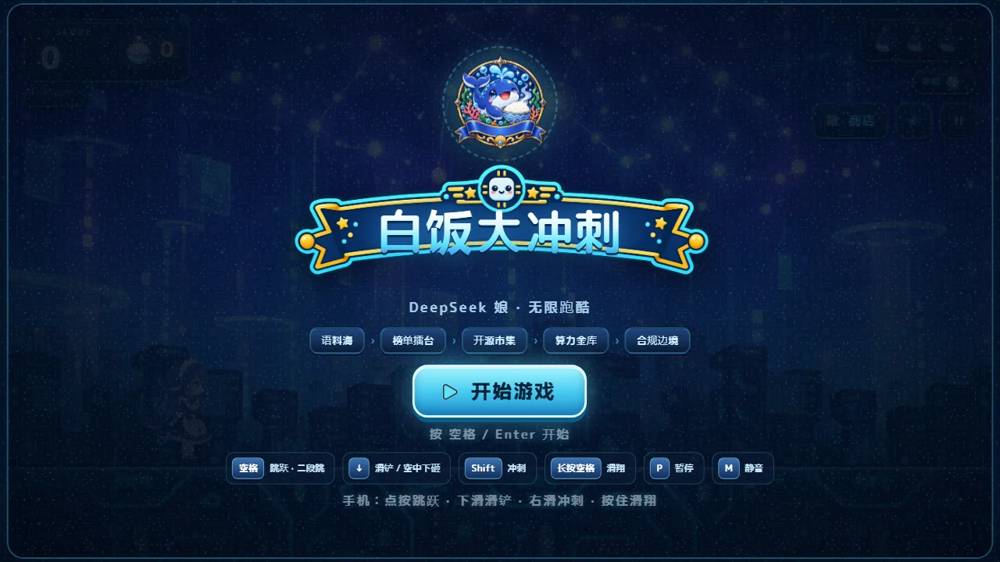
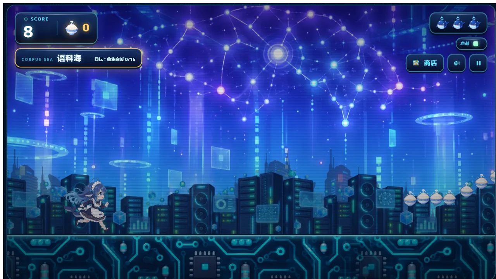

<div align="center">
  

  # 白饭大冲刺

  **DeepSeek 娘主题的街机风横版 2D 无尽跑酷游戏**

  <a href="#游戏简介">游戏简介</a>
  ·
  <a href="#操作">操作</a>
  ·
  <a href="#本地运行">本地运行</a>
  ·
  <a href="#许可证与素材">许可证与素材</a>
</div>

<br />

## 游戏简介

玩家操控 DeepSeek 娘在 AI 主题的赛道上持续奔跑，躲避障碍、收集白饭、触发事件并购买本局技能。游戏采用固定 1280×720 虚拟舞台，再根据窗口尺寸整体缩放，适合桌面浏览器和移动端触摸操作。

游戏没有后端、账号或联网接口，最高分保存在浏览器本地。

## 功能

<div align="center">
  
  <br />
  <sub>奔跑中的 DeepSeek 娘、HUD 面板与沿途白饭</sub>
</div>

<table>
  <tr>
    <td width="33%" align="center">
      <strong>无尽跑酷</strong><br />
      <sub>跳跃、二段跳、滑铲和多种障碍编排</sub>
    </td>
    <td width="33%" align="center">
      <strong>动作组合</strong><br />
      <sub>冲刺、下砸、滑翔与事件障碍</sub>
    </td>
    <td width="33%" align="center">
      <strong>分区与商店</strong><br />
      <sub>沿距离推进，使用白饭购买本局技能</sub>
    </td>
  </tr>
</table>

## 操作

### 键盘

```text
空格           跳跃 / 二段跳
↓              滑铲 / 空中下砸
Shift          冲刺
长按空格       滑翔
P              暂停
M              静音
Enter          开始游戏
```

### 手机触摸

触屏下屏幕角落会出现手柄按钮：

```text
右下「跳跃」   点按跳跃 / 二段跳，按住到达最高点后滑翔
左下「滑铲」   地面按住滑铲，空中按住下砸
左下「冲刺」   点按冲刺（次数耗尽时按钮变暗）
```

也可以直接用全屏手势，两种操作随时可混用：

```text
点按           跳跃 / 二段跳
下滑           滑铲（地面）/ 空中下砸
右滑           冲刺
```

手机请横屏游玩。舞台固定 16:9，竖屏下只有中间一条可见，页面会提示旋转。

手机全屏：标题页的「全屏」按钮（Android / 桌面浏览器），进入后还会尝试锁定横屏；iPhone 的 Safari 不提供网页全屏接口，请用「分享 → 添加到主屏幕」后从主屏幕启动。游戏内右上角也有全屏按钮，便于跑动中随时切换。

## 本地运行

不要直接用 `file://` 打开 `index.html`，游戏会通过 `fetch` 读取 `assets/manifest.json`。

```bash
python -m http.server 8123
```

然后访问 `http://localhost:8123/index.html`。Windows 用户也可以双击 `启动游戏.bat`。

## 项目结构

- `index.html`：页面、HUD 和启动界面
- `src/game.js`：跑酷引擎、输入、碰撞、分区和商店
- `src/memes.js`：事件、分区和技能数据
- `src/audio.js`：使用 Web Audio API 程序合成的音效与音乐
- `assets/`：运行时成品素材；背景图同时提供 PNG 与 WebP，游戏优先使用 WebP
- `tools/`：素材构建、碰撞箱生成和离线平衡验证工具
- `docs/plans/`：设计与验证记录

## 内容管理与构建

公开版是运行时发布版，不包含 `assets/raw/` 和 `image_形象/` 中的原始/参考素材。`tools/build_assets.py` 仍保留在仓库中，但从零重建全部素材需要另行取得这些输入文件。

运行时背景图提供 PNG 与 WebP 两种格式，游戏优先加载 WebP；浏览器不支持或 WebP 文件加载失败时回退到 PNG。

```text
修改或重新生成素材
        ↓
运行 tools/build_assets.py
        ↓
更新 assets/ 下的成品素材与 manifest.json
        ↓
部署静态文件
```

## 验证

```bash
node --check src/game.js
node --check src/memes.js
node --check src/audio.js
python tools/verify_balance.py
```

`tools/verify_balance.py` 是离线数值检查，不替代浏览器中的完整长跑测试。不同阶段的浏览器覆盖范围和未验证项见 `docs/plans/` 中的记录。

## 部署

这是静态网站，可部署到 Cloudflare Pages、GitHub Pages 或其他静态托管服务。发布时需要同时上传 `index.html`、`src/` 和 `assets/`。

## 许可证与素材

源码、构建脚本和文档采用 MIT License，见 [`LICENSE`](LICENSE)。

运行时图片和其他素材不自动继承代码许可证，来源和再分发边界见 [`ASSET-LICENSE.md`](ASSET-LICENSE.md)。本项目为个人演示/同人风格作品，不代表 DeepSeek 或其他相关品牌的官方立场。

如果要公开部署或二次分发，请先逐项确认角色形象、品牌名称和图片素材的使用权限。

## 网站作者

**EDMOK**

项目仓库：<https://github.com/EDMOK>

欢迎通过 Issue 提交可复现的 Bug、素材加载问题或改进建议。
