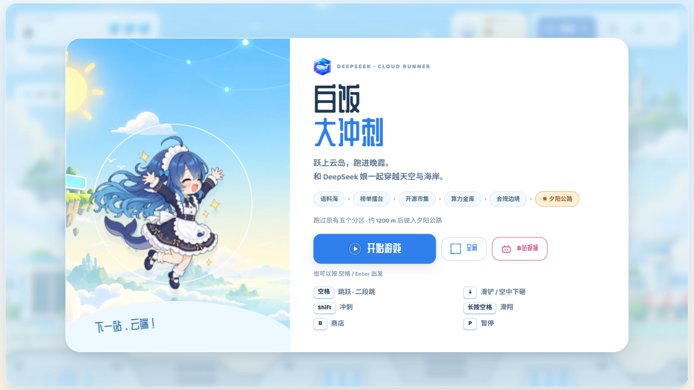
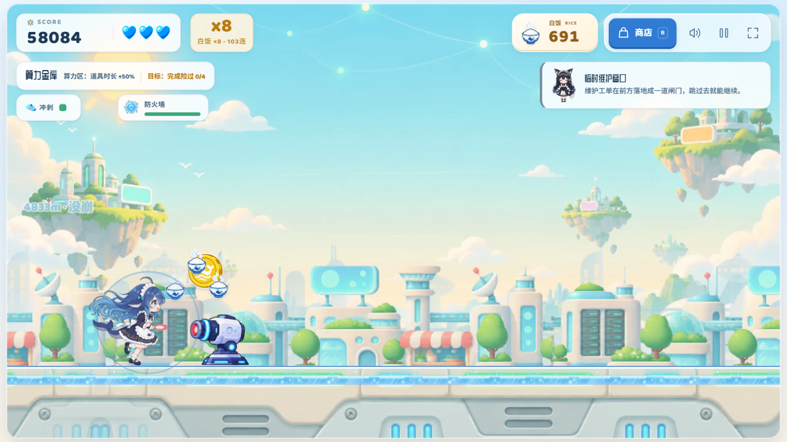
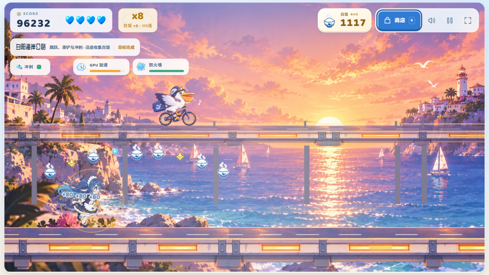
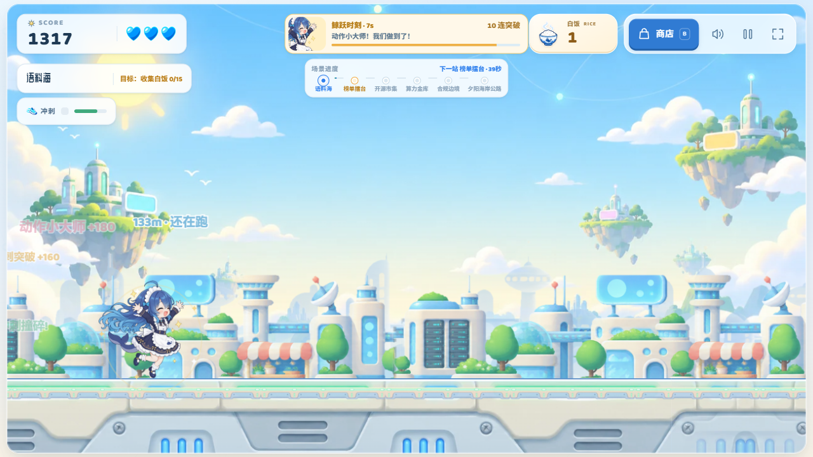
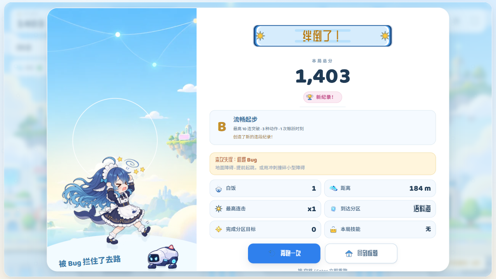

<div align="center">
  

  # 白饭大冲刺

  **DeepSeek 娘主题的明亮 AI 城市横版 2D 无尽跑酷游戏**

  跃上云岛，穿过城市与夕阳海岸，在越来越快的节奏里收集白饭、突破机关，跑出属于自己的最高分。

  <a href="https://github.com/EDMOK/fishrunning" title="访问 fishrunning GitHub 仓库">
    
  </a>
  <a href="#加入-qq-群" title="加入 QQ 群">
    
  </a>
  <br />
  <sub>GitHub 仓库 · QQ 群入口</sub>
  <br />
  <a href="#游戏简介">游戏简介</a>
  ·
  <a href="#操作">操作</a>
  ·
  <a href="#本地运行">本地运行</a>
  ·
  <a href="#许可证与素材">许可证与素材</a>
</div>

<br />

<div align="center">
  
  <br />
  <sub>在明亮的 AI 公共城市中奔跑，观察障碍、收集白饭并规划下一步动作。</sub>
</div>

## 加入 QQ 群

<a href="#加入-qq-群" title="查看 QQ 群加入方式">
  
</a>

QQ群号：**1041665197**。点击上方 QQ 图标，或搜索群号加入交流、反馈问题和分享玩法。

## 游戏简介

《白饭大冲刺》是一款面向浏览器的街机风横版无尽跑酷游戏。玩家操控 DeepSeek 娘在 AI 主题赛道上持续前进，躲避障碍、收集白饭、触发事件、购买本局技能，并在连续突破中积累更高的分数与连段。

游戏采用固定 **1280 × 720** 虚拟舞台，再根据窗口尺寸整体缩放；桌面端使用键盘，移动端使用屏幕按钮或全屏手势。项目没有后端、账号或联网接口，最高分保存在浏览器本地。

<div align="center">
  
  <br />
  <sub>跑过城市分区后进入夕阳海岸公路，新的风景与更密集的复合编排会逐步展开。</sub>
</div>

## 游戏特色

<table>
  <tr>
    <td width="33%" align="center">
      <strong>读节奏的跑酷</strong><br />
      <sub>跳跃、二段跳、滑铲、下砸、冲刺与滑翔组成连续动作链</sub>
    </td>
    <td width="33%" align="center">
      <strong>逐步升级的赛道</strong><br />
      <sub>城市云岛、多个功能分区与夕阳海岸按有效跑步时间推进</sub>
    </td>
    <td width="33%" align="center">
      <strong>可学习的动态机关</strong><br />
      <sub>脉冲防火墙、摆动电缆、巡逻无人机与延迟塌陷平台都有视觉预警</sub>
    </td>
  </tr>
  <tr>
    <td width="33%" align="center">
      <strong>白饭与本局技能</strong><br />
      <sub>收集白饭，在商店购买 GPU 加速、防火墙、数据吸附和超频</sub>
    </td>
    <td width="33%" align="center">
      <strong>鲸跃时刻</strong><br />
      <sub>漂亮突破会积累高光能量，触发收集与得分加倍的奖励阶段</sub>
    </td>
    <td width="33%" align="center">
      <strong>桌面与手机都能玩</strong><br />
      <sub>支持键盘、触屏按钮、点按与滑动手势，手机建议横屏游玩</sub>
    </td>
  </tr>
</table>

## 游戏画面

<div align="center">
  
  <br />
  <sub>动作突破、连段、白饭收集与分区进度集中在同一套 HUD 中。</sub>
</div>

<br />

<div align="center">
  
  <br />
  <sub>结束后会展示分数、最高连击、到达分区、完成目标与本局技能。</sub>
</div>

<br />

<div align="center">
  
  <br />
  <sub>移动端横屏界面：左侧动作按钮，右侧跳跃按钮，也支持全屏手势操作。</sub>
</div>

## 操作

### 键盘

```text
空格           跳跃 / 二段跳
↓              滑铲 / 空中下砸
Shift          冲刺
长按空格       滑翔
B              打开商店
P              暂停
M              静音
Enter          开始游戏
```

### 手机触摸

触屏下屏幕角落会出现动作按钮：

```text
右下「跳跃」   点按跳跃 / 二段跳，按住到达最高点后滑翔
左下「滑铲」   地面按住滑铲，空中按住下砸
左下「冲刺」   点按冲刺，次数耗尽时按钮变暗
```

也可以直接使用全屏手势，两种操作随时可以混用：

```text
点按           跳跃 / 二段跳
下滑           滑铲（地面）/ 空中下砸
右滑           冲刺
```

手机请横屏游玩。横屏时画面会自动适配屏幕宽度；竖屏下会提示旋转。标题页和游戏内都提供全屏按钮，iPhone Safari 可使用“添加到主屏幕”后以网页应用方式启动。

## 赛道与玩法循环

```text
准备连段
    ↓
观察障碍与收集路线
    ↓
跳跃 / 滑铲 / 冲刺 / 下砸完成突破
    ↓
收集白饭、触发高光并进入下一组编排
    ↓
在商店购买本局技能，继续跑向更远的分区
```

### 城市云岛 → 夕阳海岸

游戏从明亮的 AI 城市开始，原有分区会随有效跑步时间逐步展开。约 **4 分 30 秒**后，赛道平滑切换到夕阳海岸公路；暂停和商店停留不计入推进时间，城市与海岸共用扩充后的平台、空洞、障碍和收集物组合池。

### 特色机关与动态陷阱

特色机关会先以单体形式教学，再进入复合编排。动态陷阱遵循“可预测、可观察、可学习”的原则：

- **脉冲防火墙**：固定周期切换危险与安全窗口。
- **摆动数据电缆**：沿固定轨迹摆动，完整轨迹会提前呈现。
- **巡逻验证无人机**：沿固定路径上下巡逻，端点和方向清晰可读。
- **延迟塌陷平台**：踩中后出现裂纹与倒计时，随后下沉。

<div align="center">
  
  <br />
  <sub>城市赛道中的特色机关与动态障碍。</sub>
</div>

## 本地运行

不要直接用 `file://` 打开 `index.html`，游戏会通过 `fetch` 读取 `assets/manifest.json`。

```bash
python -m http.server 8123
```

然后访问：

```text
http://localhost:8123/index.html
```

Windows 用户也可以双击仓库中的 `启动游戏.bat`。

## 项目结构

- `index.html`：页面、HUD、启动界面和运行时脚本入口
- `src/game.js`：跑酷引擎、输入、碰撞、分区、事件和商店
- `src/memes.js`：分区、事件、技能和内容数据
- `src/route-patterns.js`：平台、空洞、障碍与收集物的路线编排
- `src/obstacle-specials.js`：特色机关与动态陷阱的状态和绘制逻辑
- `src/experience.js`：动作突破、连段和鲸跃时刻
- `src/audio.js`：使用 Web Audio API 程序合成的音效与音乐
- `assets/`：运行时成品素材与 `manifest.json`
- `tools/`：素材构建、碰撞箱生成、平衡审计和浏览器验证工具
- `docs/`：设计记录、验证截图和体验研究资料

## 内容管理与构建

公开版是运行时发布版，不包含 `assets/raw/` 和 `image_形象/` 中的原始或参考素材。`tools/build_assets.py` 仍保留在仓库中，但从零重建全部素材需要另行取得这些输入文件。

运行时背景图提供 PNG 与 WebP 两种格式，游戏优先加载 WebP；浏览器不支持或 WebP 加载失败时回退到 PNG。

```text
修改或重新生成素材
        ↓
运行 tools/build_assets.py
        ↓
更新 assets/ 下的成品素材与 manifest.json
        ↓
启动静态服务器并进行浏览器验证
```

## 验证

```bash
node --check src/game.js
node --check src/memes.js
node --check src/audio.js
python tools/verify_balance.py
node tools/verify_routes.cjs
node tools/verify_experience.cjs
node tools/verify_special_obstacles.cjs
node tools/verify_dynamic_hazards_browser.cjs
```

离线平衡检查、路线检查和浏览器验证各自覆盖不同边界，不能完全替代真人试玩。动态陷阱的可读性、后期节奏和移动端实际手感仍应在目标设备上确认。

## 部署

这是一个纯静态网站，可部署到 GitHub Pages、Cloudflare Pages 或其他静态托管服务。发布时需要同时上传：

```text
index.html
src/
assets/
```

## 许可证与素材

源码、构建脚本和文档采用 MIT License，见 [`LICENSE`](LICENSE)。

运行时图片和其他素材不自动继承代码许可证，来源和再分发边界见 [`ASSET-LICENSE.md`](ASSET-LICENSE.md)。项目是个人演示 / 同人风格作品，不代表 DeepSeek 或其他相关品牌的官方立场。

如果要公开部署或二次分发，请逐项确认角色形象、品牌名称和图片素材的使用权限。

## 网站作者

**EDMOK**

GitHub 仓库：<https://github.com/EDMOK/fishrunning>

欢迎通过 [GitHub Issue](https://github.com/EDMOK/fishrunning/issues) 提交可复现的 Bug、素材加载问题或改进建议。
